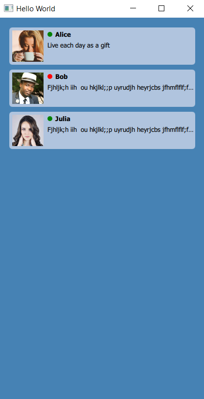
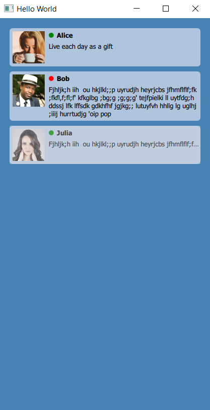
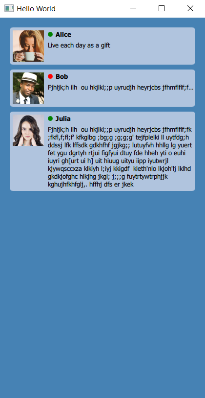

# qml_android

Писать UI для Android на QT

Android Broadcast. Все об Андроид разработке
https://www.youtube.com/watch?v=AzP2Yy_O0Cg&t=3533s

- **Qt | QML**

- **main points**: delegate | property alias | states | PropertyAnimation | Text elide | clip

